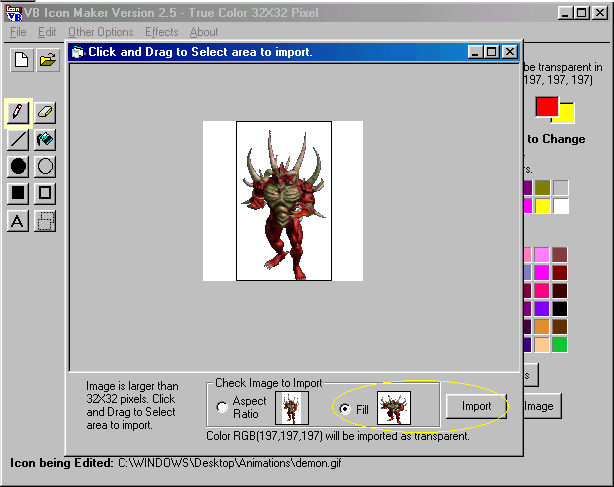



## VBIconMaker

### Description

This is a true ICON maker.I found it browsing around the world of V.B.<web-browsing,& READING,LOTS of READING!> .Anyways , i've tried out all of the icon utilities here on P.S.C.,found 1 that came close to being great but this,this 1 I have GOT to share with everyone!Supports true <GET|IMAGE|FILE> And has excellnt OutPut of the new Icon you create.While the code is not mine in anyway what-so-ever , I release it here to you on P.S.C. in it's entirety , untouched or altered in anyway and I suggest you do the same because it does'nt need any touch-ups! just enjoy/FREE to ME/FREE to you!This program is about a donkey hair away from being charged for(MY opinion)
 
### More Info
 

             |
---                |---
**Submitted On**   |2001-12-22 15:34:26
**By**             |[Danny Pryor](https://github.com/Planet-Source-Code/PSCIndex/blob/master/ByAuthor/danny-pryor.md)
**Level**          |Intermediate
**User Rating**    |4.8 (92 globes from 19 users)
**Compatibility**  |VB 6\.0
**Category**       |[Complete Applications](https://github.com/Planet-Source-Code/PSCIndex/blob/master/ByCategory/complete-applications__1-27.md)
**World**          |[Visual Basic](https://github.com/Planet-Source-Code/PSCIndex/blob/master/ByWorld/visual-basic.md)
**Archive File**   |[VBIconMake4370412232001\.zip](https://github.com/Planet-Source-Code/danny-pryor-vbiconmaker__1-30058/archive/master.zip)

